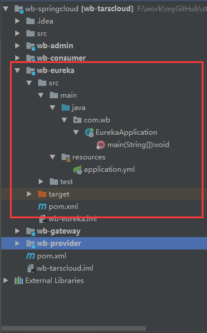
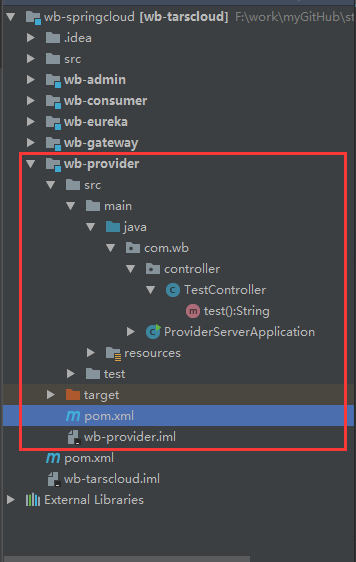
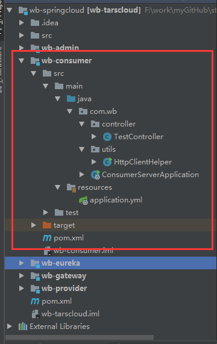

# Eureka使用

## 目录

* **eureka 名字服务**

* gateway 网关

  ​

## 简介

本文着重介绍springcloud微服务治理核心组件 eureka，eureka在springcloud中扮演者名字中心的角色，负责服务的注册与发现。

## 术语

> * Eureka server：服务注册中心
> * Eureka instance：一个服务实例
> * Eureka service：指的是服务，提供一种特定功能的服务，如：订单系统，而同一个服务可以提供多个instance;
> * Eureka client：主要将自己的服务注册到服务中心。但它既可以是服务的提供者也可以是消费者。它与Eureka instance感觉差不多，但其实意义是不一样的，Eureka client是相较于Eureka server来说的。而Eureka instance更倾向于负载技术。

## demo

### eureka server

* 代码结构

  


* pom.xml 配置

  ```xml
  <?xml version="1.0" encoding="UTF-8"?>
  <project xmlns="http://maven.apache.org/POM/4.0.0"
           xmlns:xsi="http://www.w3.org/2001/XMLSchema-instance"
           xsi:schemaLocation="http://maven.apache.org/POM/4.0.0 http://maven.apache.org/xsd/maven-4.0.0.xsd">
      <modelVersion>4.0.0</modelVersion>

      <parent>
          <groupId>org.springframework.boot</groupId>
          <artifactId>spring-boot-starter-parent</artifactId>
          <version>2.0.2.RELEASE</version>
          <relativePath/>
      </parent>

      <groupId>com.wb</groupId>
      <artifactId>wb-eureka</artifactId>
      <version>1.0-SNAPSHOT</version>

      <dependencies>
          <dependency>
              <groupId>org.springframework.boot</groupId>
              <artifactId>spring-boot-starter</artifactId>
          </dependency>
          <dependency>
              <groupId>org.springframework.cloud</groupId>
              <artifactId>spring-cloud-starter-netflix-eureka-server</artifactId>
          </dependency>
      </dependencies>

      <dependencyManagement>
          <dependencies>
              <dependency>
                  <groupId>org.springframework.cloud</groupId>
                  <artifactId>spring-cloud-dependencies</artifactId>
                  <version>Finchley.RELEASE</version>
                  <type>pom</type>
                  <scope>import</scope>
              </dependency>
          </dependencies>
      </dependencyManagement>


  </project>
  ```

* application.yml

  ```yaml
  ## server
  server:
    port: 17000

  spring:
    application:
      name: eureka-server

  ##eureka
  #  设置注册中心地址
  eureka:
    client:
      register-with-eureka: false # 禁止向eureka注册自己
      fetch-registry: false # 禁止向eureka寻址
      service-url:
            defaultZone: http://127.0.0.1:${server.port}/eureka/
  ```

* ApplicationServer

  ```java
  package com.wb;

  import org.springframework.boot.SpringApplication;
  import org.springframework.boot.autoconfigure.SpringBootApplication;
  import org.springframework.cloud.netflix.eureka.server.EnableEurekaServer;

  @EnableEurekaServer
  @SpringBootApplication
  public class EurekaApplication {
      public static void main(String[] args) {
          SpringApplication.run(EurekaApplication.class, args);
      }
  }

  ```

启动 EurekaApplication后，访问地址`http://127.0.0.1:17000` 可以看到eureka展示界面，至此一个最简单的eurekaserver已经启动，访问界面如下


### eureka client

#### provider server 服务提供方

* 代码结构

  

  ​

- pom.xml配置

  ```xml
  <?xml version="1.0" encoding="UTF-8"?>
  <project xmlns="http://maven.apache.org/POM/4.0.0"
           xmlns:xsi="http://www.w3.org/2001/XMLSchema-instance"
           xsi:schemaLocation="http://maven.apache.org/POM/4.0.0 http://maven.apache.org/xsd/maven-4.0.0.xsd">
      <parent>
          <groupId>org.springframework.boot</groupId>
          <artifactId>spring-boot-starter-parent</artifactId>
          <version>2.0.2.RELEASE</version>
          <relativePath/>
      </parent>

      <modelVersion>4.0.0</modelVersion>

      <groupId>com.wb</groupId>
      <artifactId>wb-provider</artifactId>

      <dependencies>
          <dependency>
              <groupId>org.springframework.cloud</groupId>
              <artifactId>spring-cloud-starter-netflix-eureka-server</artifactId>
          </dependency>
      </dependencies>

      <dependencyManagement>
          <dependencies>
              <dependency>
                  <groupId>org.springframework.cloud</groupId>
                  <artifactId>spring-cloud-dependencies</artifactId>
                  <version>Finchley.RC2</version>
                  <type>pom</type>
                  <scope>import</scope>
              </dependency>
          </dependencies>
      </dependencyManagement>

  </project>
  ```

  ​

- application.yml配置

  ```yaml
  server:
    port: 17001
    servlet:
      context-path: /provider/

  #  设置服务名
  spring:
    application:
      name: wb-provider

  eureka:
    client:
      service-url:
        defaultZone: http://127.0.0.1:17000/eureka/ #  设置注册中心地址
    instance:
      instance-id: ${spring.application.name}:${server.port} #  实例名称
      prefer-ip-address: true  # 使用ip注册，默认未false使用hostname
  ```

  ​

- 代码

  ProviderServerApplication.java

  ```
  package com.wb;

  import org.springframework.boot.SpringApplication;
  import org.springframework.boot.autoconfigure.SpringBootApplication;

  @SpringBootApplication
  public class ProviderServerApplication {
      public static void main(String[] args) {
          SpringApplication.run(ProviderServerApplication.class, args);
      }
  }

  ```

  TestController.java

  ``` java
  package com.wb.controller;

  import org.springframework.web.bind.annotation.RequestMapping;
  import org.springframework.web.bind.annotation.RestController;

  @RestController
  public class TestController {

      @RequestMapping("/test")
      public String test(){
          return "this is provider server test interface";
      }
  }
  ```


​	服务启动后，就可以在 eureka 中看到providerserver已经注册进名字中了

#### consumer server 服务消费方

* 代码结构

  

- pom.xml配置

  ``` xml
  <?xml version="1.0" encoding="UTF-8"?>
  <project xmlns="http://maven.apache.org/POM/4.0.0"
           xmlns:xsi="http://www.w3.org/2001/XMLSchema-instance"
           xsi:schemaLocation="http://maven.apache.org/POM/4.0.0 http://maven.apache.org/xsd/maven-4.0.0.xsd">
      <parent>
          <groupId>org.springframework.boot</groupId>
          <artifactId>spring-boot-starter-parent</artifactId>
          <version>2.0.0.RELEASE</version>
          <relativePath/>
      </parent>

      <modelVersion>4.0.0</modelVersion>

      <groupId>com.wb</groupId>
      <artifactId>wb-consumer</artifactId>

      <properties>
          <project.build.sourceEncoding>UTF-8</project.build.sourceEncoding>
          <project.reporting.outputEncoding>UTF-8</project.reporting.outputEncoding>
          <java.version>1.8</java.version>
          <spring-cloud.version>Finchley.RC2</spring-cloud.version>
      </properties>

      <dependencies>
          <dependency>
              <groupId>org.springframework.cloud</groupId>
              <artifactId>spring-cloud-starter-netflix-eureka-server</artifactId>
          </dependency>

          <dependency>
              <groupId>org.springframework.boot</groupId>
              <artifactId>spring-boot-starter-test</artifactId>
              <scope>test</scope>
          </dependency>

          <dependency>
              <groupId>commons-httpclient</groupId>
              <artifactId>commons-httpclient</artifactId>
              <version>3.1</version>
          </dependency>
      </dependencies>

      <dependencyManagement>
          <dependencies>
              <dependency>
                  <groupId>org.springframework.cloud</groupId>
                  <artifactId>spring-cloud-dependencies</artifactId>
                  <version>${spring-cloud.version}</version>
                  <type>pom</type>
                  <scope>import</scope>
              </dependency>
          </dependencies>
      </dependencyManagement>

      <build>
          <plugins>
              <plugin>
                  <groupId>org.springframework.boot</groupId>
                  <artifactId>spring-boot-maven-plugin</artifactId>
              </plugin>
          </plugins>
      </build>

      <repositories>
          <repository>
              <id>spring-milestones</id>
              <name>Spring Milestones</name>
              <url>https://repo.spring.io/milestone</url>
              <snapshots>
                  <enabled>false</enabled>
              </snapshots>
          </repository>
      </repositories>

  </project>
  ```

  ​

- application.yml配置

  ``` yaml
  server:
    port: 17002
    servlet:
      context-path: /consumer/

  #  设置服务名
  spring:
    application:
      name: wb-consumer

  eureka:
    client:
      service-url:
        defaultZone: http://127.0.0.1:17000/eureka/ #  设置注册中心地址
    instance:
      instance-id: ${spring.application.name}:${server.port} #  实例名称
      prefer-ip-address: true  # 使用ip注册，默认未false使用hostname

  ```

  ​

- 代码

  ConsumerServerApplication.java

  ``` java
  package com.wb;

  import org.springframework.boot.SpringApplication;
  import org.springframework.boot.autoconfigure.SpringBootApplication;
  import org.springframework.cloud.client.loadbalancer.LoadBalanced;
  import org.springframework.cloud.netflix.eureka.EnableEurekaClient;
  import org.springframework.context.annotation.Bean;
  import org.springframework.web.client.RestTemplate;

  @EnableEurekaClient
  @SpringBootApplication
  public class ConsumerServerApplication {

      public static void main(String[] args) {
          SpringApplication.run(ConsumerServerApplication.class, args);
      }

      @Bean
      @LoadBalanced
      public RestTemplate restTemplate() {
          return new RestTemplate();
      }
  }

  ```

  TestController.java

  ``` java
  package com.wb.controller;

  import com.wb.utils.HttpClientHelper;
  import org.springframework.beans.factory.annotation.Value;
  import org.springframework.cloud.client.ServiceInstance;
  import org.springframework.cloud.client.discovery.DiscoveryClient;
  import org.springframework.beans.factory.annotation.Autowired;
  import org.springframework.web.bind.annotation.*;
  import org.slf4j.Logger;
  import org.slf4j.LoggerFactory;
  import org.springframework.web.client.RestTemplate;

  import java.io.IOException;
  import java.util.List;


  @RestController
  public class TestController {

      private final Logger LOGGER= LoggerFactory.getLogger(getClass());

      @Autowired
      DiscoveryClient discoveryClient;

      @Autowired
      RestTemplate restTemplate;

      private String providerName = "WB-PROVIDER";


      @GetMapping(value="/servers")
      public String getServers() {
          List<ServiceInstance> serviceInstances = discoveryClient.getInstances(providerName);

          String res = "";
          for (ServiceInstance serviceInstance : serviceInstances) {
              res += serviceInstance.getUri() + "\n";
          }

          return res;
      }


      @GetMapping(value = "/call")
      public String test() throws IOException {

          String res = restTemplate.getForObject("http://" + providerName + "/provider/test", String.class);

          return "this is wb-consumer call provider res:" + res ;
      }
  }
  ```

  HttpClientHelper.java

  ```java
  package com.wb.utils;

  import java.io.IOException;

  import org.apache.commons.httpclient.HttpClient;
  import org.apache.commons.httpclient.HttpException;
  import org.apache.commons.httpclient.methods.GetMethod;
  import org.apache.commons.httpclient.methods.PostMethod;
  import org.apache.commons.httpclient.params.HttpMethodParams;

  public class HttpClientHelper {
      public static String sendPost(String urlParam) throws HttpException, IOException {
          // 创建httpClient实例对象
          HttpClient httpClient = new HttpClient();
          // 设置httpClient连接主机服务器超时时间：15000毫秒
          httpClient.getHttpConnectionManager().getParams().setConnectionTimeout(15000);
          // 创建post请求方法实例对象
          PostMethod postMethod = new PostMethod(urlParam);
          // 设置post请求超时时间
          postMethod.getParams().setParameter(HttpMethodParams.SO_TIMEOUT, 60000);
          postMethod.addRequestHeader("Content-Type", "application/json");

          httpClient.executeMethod(postMethod);

          String result = postMethod.getResponseBodyAsString();
          postMethod.releaseConnection();
          return result;
      }
      public static String sendGet(String urlParam) throws HttpException, IOException {
          // 创建httpClient实例对象
          HttpClient httpClient = new HttpClient();
          // 设置httpClient连接主机服务器超时时间：15000毫秒
          httpClient.getHttpConnectionManager().getParams().setConnectionTimeout(15000);
          // 创建GET请求方法实例对象
          GetMethod getMethod = new GetMethod(urlParam);
          // 设置post请求超时时间
          getMethod.getParams().setParameter(HttpMethodParams.SO_TIMEOUT, 60000);
          getMethod.addRequestHeader("Content-Type", "application/json");

          httpClient.executeMethod(getMethod);

          String result = getMethod.getResponseBodyAsString();
          getMethod.releaseConnection();
          return result;
      }
      public static void main(String[] args) throws HttpException, IOException {
          String url ="http://int.dpool.sina.com.cn/iplookup/iplookup.php?ip=120.79.75.96";
          System.out.println(sendPost(url));
          System.out.println(sendGet(url));
      }
  }
  ```

  服务启动后就可以看到consumer 注册到名字中了

## 常用配置

### eureka server常用配置

```properties
################server 与 client 关联的配置#####################33
#服务端开启自我保护模式。无论什么情况，服务端都会保持一定数量的服务。避免client与server的网络问题，而出现大量的服务被清除。
eureka.server.enable-self-preservation=true
#开启清除无效服务的定时任务，时间间隔。默认1分钟
eureka.server.eviction-interval-timer-in-ms= 60000
#间隔多长时间，清除过期的delta数据
eureka.server.delta-retention-timer-interval-in-ms=0
#过期数据，是否也提供给client
eureka.server.disable-delta=false
#eureka服务端是否记录client的身份header
eureka.server.log-identity-headers=true
#请求频率限制器
eureka.server.rate-limiter-burst-size=10
#是否开启请求频率限制器
eureka.server.rate-limiter-enabled=false
#请求频率的平均值
eureka.server.rate-limiter-full-fetch-average-rate=100
#是否对标准的client进行频率请求限制。如果是false，则只对非标准client进行限制
eureka.server.rate-limiter-throttle-standard-clients=false
#注册服务、拉去服务列表数据的请求频率的平均值
eureka.server.rate-limiter-registry-fetch-average-rate=500
#设置信任的client list
eureka.server.rate-limiter-privileged-clients=
#在设置的时间范围类，期望与client续约的百分比。
eureka.server.renewal-percent-threshold=0.85
#多长时间更新续约的阈值
eureka.server.renewal-threshold-update-interval-ms=0
#对于缓存的注册数据，多长时间过期
eureka.server.response-cache-auto-expiration-in-seconds=180
#多长时间更新一次缓存中的服务注册数据
eureka.server.response-cache-update-interval-ms=0
#缓存增量数据的时间，以便在检索的时候不丢失信息
eureka.server.retention-time-in-m-s-in-delta-queue=0
#当时间戳不一致的时候，是否进行同步
eureka.server.sync-when-timestamp-differs=true
#是否采用只读缓存策略，只读策略对于缓存的数据不会过期。
eureka.server.use-read-only-response-cache=true
 
################server 自定义实现的配置#####################33
#json的转换的实现类名
eureka.server.json-codec-name=
#PropertyResolver
eureka.server.property-resolver=
#eureka server xml的编解码实现名称
eureka.server.xml-codec-name=
 
################server node 与 node 之间关联的配置#####################33
#发送复制数据是否在request中，总是压缩
eureka.server.enable-replicated-request-compression=false
#指示群集节点之间的复制是否应批处理以提高网络效率。
eureka.server.batch-replication=false
#允许备份到备份池的最大复制事件数量。而这个备份池负责除状态更新的其他事件。可以根据内存大小，超时和复制流量，来设置此值得大小
eureka.server.max-elements-in-peer-replication-pool=10000
#允许备份到状态备份池的最大复制事件数量
eureka.server.max-elements-in-status-replication-pool=10000
#多个服务中心相互同步信息线程的最大空闲时间
eureka.server.max-idle-thread-age-in-minutes-for-peer-replication=15
#状态同步线程的最大空闲时间
eureka.server.max-idle-thread-in-minutes-age-for-status-replication=15
#服务注册中心各个instance相互复制数据的最大线程数量
eureka.server.max-threads-for-peer-replication=20
#服务注册中心各个instance相互复制状态数据的最大线程数量
eureka.server.max-threads-for-status-replication=1
#instance之间复制数据的通信时长
eureka.server.max-time-for-replication=30000
#正常的对等服务instance最小数量。-1表示服务中心为单节点。
eureka.server.min-available-instances-for-peer-replication=-1
#instance之间相互复制开启的最小线程数量
eureka.server.min-threads-for-peer-replication=5
#instance之间用于状态复制，开启的最小线程数量
eureka.server.min-threads-for-status-replication=1
#instance之间复制数据时可以重试的次数
eureka.server.number-of-replication-retries=5
#eureka节点间间隔多长时间更新一次数据。默认10分钟。
eureka.server.peer-eureka-nodes-update-interval-ms=600000
#eureka服务状态的相互更新的时间间隔。
eureka.server.peer-eureka-status-refresh-time-interval-ms=0
#eureka对等节点间连接超时时间
eureka.server.peer-node-connect-timeout-ms=200
#eureka对等节点连接后的空闲时间
eureka.server.peer-node-connection-idle-timeout-seconds=30
#节点间的读数据连接超时时间
eureka.server.peer-node-read-timeout-ms=200
#eureka server 节点间连接的总共最大数量
eureka.server.peer-node-total-connections=1000
#eureka server 节点间连接的单机最大数量
eureka.server.peer-node-total-connections-per-host=10
#在服务节点启动时，eureka尝试获取注册信息的次数
eureka.server.registry-sync-retries=
#在服务节点启动时，eureka多次尝试获取注册信息的间隔时间
eureka.server.registry-sync-retry-wait-ms=
#当eureka server启动的时候，不能从对等节点获取instance注册信息的情况，应等待多长时间。
eureka.server.wait-time-in-ms-when-sync-empty=0
 
################server 与 remote 关联的配置#####################33
#过期数据，是否也提供给远程region
eureka.server.disable-delta-for-remote-regions=false
#回退到远程区域中的应用程序的旧行为 (如果已配置) 如果本地区域中没有该应用程序的实例, 则将被禁用。
eureka.server.disable-transparent-fallback-to-other-region=false
#指示在服务器支持的情况下, 是否必须为远程区域压缩从尤里卡服务器获取的内容。
eureka.server.g-zip-content-from-remote-region=true
#连接eureka remote note的连接超时时间
eureka.server.remote-region-connect-timeout-ms=1000
#remote region 应用白名单
eureka.server.remote-region-app-whitelist.
#连接eureka remote note的连接空闲时间
eureka.server.remote-region-connection-idle-timeout-seconds=30
#执行remote region 获取注册信息的请求线程池大小
eureka.server.remote-region-fetch-thread-pool-size=20
#remote region 从对等eureka加点读取数据的超时时间
eureka.server.remote-region-read-timeout-ms=1000
#从remote region 获取注册信息的时间间隔
eureka.server.remote-region-registry-fetch-interval=30
#remote region 连接eureka节点的总连接数量
eureka.server.remote-region-total-connections=1000
#remote region 连接eureka节点的单机连接数量
eureka.server.remote-region-total-connections-per-host=50
#remote region抓取注册信息的存储文件，而这个可靠的存储文件需要全限定名来指定
eureka.server.remote-region-trust-store=
#remote region 储存的文件的密码
eureka.server.remote-region-trust-store-password=
#remote region url.多个逗号隔开
eureka.server.remote-region-urls=
#remote region url.多个逗号隔开
eureka.server.remote-region-urls-with-name.
 
################server 与 ASG/AWS/EIP/route52 之间关联的配置#####################33
#缓存ASG信息的过期时间。
eureka.server.a-s-g-cache-expiry-timeout-ms=0
#查询ASG信息的超时时间
eureka.server.a-s-g-query-timeout-ms=300
#服务更新ASG信息的频率
eureka.server.a-s-g-update-interval-ms=0
#AWS访问ID
eureka.server.a-w-s-access-id=
#AWS安全密钥
eureka.server.a-w-s-secret-key=
#AWS绑定策略
eureka.server.binding-strategy=eip
#用于从第三方AWS 帐户描述自动扩展分组的角色的名称。
eureka.server.list-auto-scaling-groups-role-name=
#是否应该建立连接引导
eureka.server.prime-aws-replica-connections=true
#服务端尝试绑定候选EIP的次数
eureka.server.e-i-p-bind-rebind-retries=3
#服务端绑定EIP的时间间隔.如果绑定就检查;如果绑定失效就重新绑定。当且仅当已经绑定的情况
eureka.server.e-i-p-binding-retry-interval-ms=10
#服务端绑定EIP的时间间隔.当且仅当服务为绑定的情况
eureka.server.e-i-p-binding-retry-interval-ms-when-unbound=
#服务端尝试绑定route53的次数
eureka.server.route53-bind-rebind-retries=3
#服务端间隔多长时间尝试绑定route53
eureka.server.route53-binding-retry-interval-ms=30
#
eureka.server.route53-domain-t-t-l=10
```


### eureka instance 常用配置

```properties
#服务注册中心实例的主机名
eureka.instance.hostname=localhost
#注册在Eureka服务中的应用组名
eureka.instance.app-group-name=
#注册在的Eureka服务中的应用名称
eureka.instance.appname=
#该实例注册到服务中心的唯一ID
eureka.instance.instance-id=
#该实例的IP地址
eureka.instance.ip-address=
#该实例，相较于hostname是否优先使用IP
eureka.instance.prefer-ip-address=false
 
#用于AWS平台自动扩展的与此实例关联的组名，
eureka.instance.a-s-g-name=
#部署此实例的数据中心
eureka.instance.data-center-info=
#默认的地址解析顺序
eureka.instance.default-address-resolution-order=
#该实例的环境配置
eureka.instance.environment=
#初始化该实例，注册到服务中心的初始状态
eureka.instance.initial-status=up
#表明是否只要此实例注册到服务中心，立马就进行通信
eureka.instance.instance-enabled-onit=false
#该服务实例的命名空间,用于查找属性
eureka.instance.namespace=eureka
#该服务实例的子定义元数据，可以被服务中心接受到
eureka.instance.metadata-map.test = test
 
#服务中心删除此服务实例的等待时间(秒为单位),时间间隔为最后一次服务中心接受到的心跳时间
eureka.instance.lease-expiration-duration-in-seconds=90
#该实例给服务中心发送心跳的间隔时间，用于表明该服务实例可用
eureka.instance.lease-renewal-interval-in-seconds=30
#该实例，注册服务中心，默认打开的通信数量
eureka.instance.registry.default-open-for-traffic-count=1
#每分钟续约次数
eureka.instance.registry.expected-number-of-renews-per-min=1
 
#该实例健康检查url,绝对路径
eureka.instance.health-check-url=
#该实例健康检查url,相对路径
eureka.instance.health-check-url-path=/health
#该实例的主页url,绝对路径
eureka.instance.home-page-url=
#该实例的主页url,相对路径
eureka.instance.home-page-url-path=/
#该实例的安全健康检查url,绝对路径
eureka.instance.secure-health-check-url=
#https通信端口
eureka.instance.secure-port=443
#https通信端口是否启用
eureka.instance.secure-port-enabled=false
#http通信端口
eureka.instance.non-secure-port=80
#http通信端口是否启用
eureka.instance.non-secure-port-enabled=true
#该实例的安全虚拟主机名称(https)
eureka.instance.secure-virtual-host-name=unknown
#该实例的虚拟主机名称(http)
eureka.instance.virtual-host-name=unknown
#该实例的状态呈现url,绝对路径
eureka.instance.status-page-url=
#该实例的状态呈现url,相对路径
eureka.instance.status-page-url-path=/status
```


### eureka client 常用配置

``` properties
#该客户端是否可用
eureka.client.enabled=true
#实例是否在eureka服务器上注册自己的信息以供其他服务发现，默认为true
eureka.client.register-with-eureka=false
#此客户端是否获取eureka服务器注册表上的注册信息，默认为true
eureka.client.fetch-registry=false
#是否过滤掉，非UP的实例。默认为true
eureka.client.filter-only-up-instances=true
#与Eureka注册服务中心的通信zone和url地址
eureka.client.serviceUrl.defaultZone=http://${eureka.instance.hostname}:${server.port}/eureka/
 
#client连接Eureka服务端后的空闲等待时间，默认为30 秒
eureka.client.eureka-connection-idle-timeout-seconds=30
#client连接eureka服务端的连接超时时间，默认为5秒
eureka.client.eureka-server-connect-timeout-seconds=5
#client对服务端的读超时时长
eureka.client.eureka-server-read-timeout-seconds=8
#client连接all eureka服务端的总连接数，默认200
eureka.client.eureka-server-total-connections=200
#client连接eureka服务端的单机连接数量，默认50
eureka.client.eureka-server-total-connections-per-host=50
#执行程序指数回退刷新的相关属性，是重试延迟的最大倍数值，默认为10
eureka.client.cache-refresh-executor-exponential-back-off-bound=10
#执行程序缓存刷新线程池的大小，默认为5
eureka.client.cache-refresh-executor-thread-pool-size=2
#心跳执行程序回退相关的属性，是重试延迟的最大倍数值，默认为10
eureka.client.heartbeat-executor-exponential-back-off-bound=10
#心跳执行程序线程池的大小,默认为5
eureka.client.heartbeat-executor-thread-pool-size=5
# 询问Eureka服务url信息变化的频率（s），默认为300秒
eureka.client.eureka-service-url-poll-interval-seconds=300
#最初复制实例信息到eureka服务器所需的时间（s），默认为40秒
eureka.client.initial-instance-info-replication-interval-seconds=40
#间隔多长时间再次复制实例信息到eureka服务器，默认为30秒
eureka.client.instance-info-replication-interval-seconds=30
#从eureka服务器注册表中获取注册信息的时间间隔（s），默认为30秒
eureka.client.registry-fetch-interval-seconds=30
 
# 获取实例所在的地区。默认为us-east-1
eureka.client.region=us-east-1
#实例是否使用同一zone里的eureka服务器，默认为true，理想状态下，eureka客户端与服务端是在同一zone下
eureka.client.prefer-same-zone-eureka=true
# 获取实例所在的地区下可用性的区域列表，用逗号隔开。（AWS）
eureka.client.availability-zones.china=defaultZone,defaultZone1,defaultZone2
#eureka服务注册表信息里的以逗号隔开的地区名单，如果不这样返回这些地区名单，则客户端启动将会出错。默认为null
eureka.client.fetch-remote-regions-registry=
#服务器是否能够重定向客户端请求到备份服务器。 如果设置为false，服务器将直接处理请求，如果设置为true，它可能发送HTTP重定向到客户端。默认为false
eureka.client.allow-redirects=false
#客户端数据接收
eureka.client.client-data-accept=
#增量信息是否可以提供给客户端看，默认为false
eureka.client.disable-delta=false
#eureka服务器序列化/反序列化的信息中获取“_”符号的的替换字符串。默认为“__“
eureka.client.escape-char-replacement=__
#eureka服务器序列化/反序列化的信息中获取“$”符号的替换字符串。默认为“_-”
eureka.client.dollar-replacement="_-"
#当服务端支持压缩的情况下，是否支持从服务端获取的信息进行压缩。默认为true
eureka.client.g-zip-content=true
#是否记录eureka服务器和客户端之间在注册表的信息方面的差异，默认为false
eureka.client.log-delta-diff=false
# 如果设置为true,客户端的状态更新将会点播更新到远程服务器上，默认为true
eureka.client.on-demand-update-status-change=true
#此客户端只对一个单一的VIP注册表的信息感兴趣。默认为null
eureka.client.registry-refresh-single-vip-address=
#client是否在初始化阶段强行注册到服务中心，默认为false
eureka.client.should-enforce-registration-at-init=false
#client在shutdown的时候是否显示的注销服务从服务中心，默认为true
eureka.client.should-unregister-on-shutdown=true
 
# 获取eureka服务的代理主机，默认为null
eureka.client.proxy-host=
#获取eureka服务的代理密码，默认为null
eureka.client.proxy-password=
# 获取eureka服务的代理端口, 默认为null
eureka.client.proxy-port=
# 获取eureka服务的代理用户名，默认为null
eureka.client.proxy-user-name=
 
#属性解释器
eureka.client.property-resolver=
#获取实现了eureka客户端在第一次启动时读取注册表的信息作为回退选项的实现名称
eureka.client.backup-registry-impl=
#这是一个短暂的×××的配置，如果最新的×××是稳定的，则可以去除，默认为null
eureka.client.decoder-name=
#这是一个短暂的编码器的配置，如果最新的编码器是稳定的，则可以去除，默认为null
eureka.client.encoder-name=
 
#是否使用DNS机制去获取服务列表，然后进行通信。默认为false
eureka.client.use-dns-for-fetching-service-urls=false
#获取要查询的DNS名称来获得eureka服务器，此配置只有在eureka服务器ip地址列表是在DNS中才会用到。默认为null
eureka.client.eureka-server-d-n-s-name=
#获取eureka服务器的端口，此配置只有在eureka服务器ip地址列表是在DNS中才会用到。默认为null
eureka.client.eureka-server-port=
#表示eureka注册中心的路径，如果配置为eureka，则为http://x.x.x.x:x/eureka/，在eureka的配置文件中加入此配置表示eureka作为客户端向注册中心注册，从而构成eureka集群。此配置只有在eureka服务器ip地址列表是在DNS中才会用到，默认为null
eureka.client.eureka-server-u-r-l-context=
```


